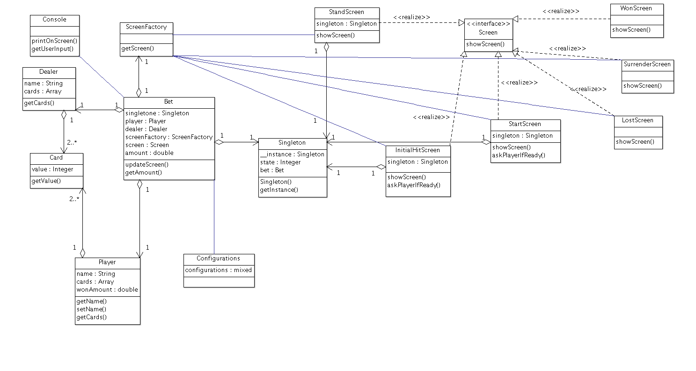

# The BlackJack

## Game Rules
1. The dealer will give you two cards.
2. You can double your bet anytime before you hit or stand and split your bet. 
3. You have an option to add more cards by choosing 'HIT'.
4. Choose 'STAND' when you are ready to play the hand. 
5. The dealer will reveal his hidden card.
6. You win when the combined value of your cards is greater than that of the dealer.

## Supported Moves
### HIT
Add More cards (Add Hands). (*not implemented*)

### STAND 
Play.

### SPLIT
Split the bet into two bets, if they get the same value cards. (*not implemented*)

### SURRENDER
Take Half ($50) Back.

### DOUBLE DOWN
Starting another bet with same amount. (*not implemented*)

## Class Diagram
